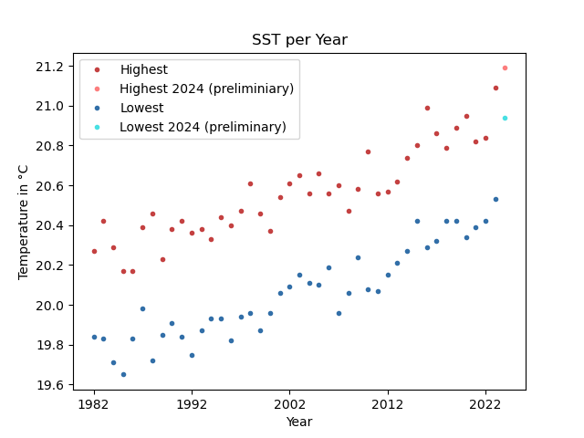

# Klima Infos

> :warning: The text in this repo is in German. \
> There is enough information in English out there, but in German it seems to be a bit lacking.

## Das Grundprinzip
Wie der Treibhauseffekt, somit die globale Erwärmung und schlussendlich die Klimakrise funktioniert, ist vermutlich jedem inzwischen bekannt. Zu Abrundung des Themas aber nochmal die Kurzfassung.

Die Sonne wärmt den Planeten. Land, Meer und Luft heizen sich tagüber durch die Sonneneinstrahlung auf. Nachts wird diese Wärme in Form
von Infrarotstrahlung wieder in den Weltraum abgegeben. Bestimmte Gase in der Atmossphere, hauptsächlich Wasserdampf, Methan und CO2 verhindern
aber das die gesamte Infrarotstrahlung in den Weltraum entweichen kann. Ein Teil der Strahlung wird wieder zurück reflektiert, trifft wieder auf die Erde und
sorgt dafür das diese sich  nicht komplett abkühlt.

Eben wie in einem Gewächshaus. Sonnenlicht kommt rein, macht es warm, Wärme(strahlung) kann aber nicht mehr vollständig entweichen. Es bleibt warm.

Der Mensch packt immer mehr CO2 in die Luft. Je mehr CO2, desto weniger Wärme kann entweichen, desto wärmer wird der Planet, ergo globale Erwärmung. Das Klima
bassiert darauf wie warm es wo im Allgemeinen ist. Wenn sich das ändert, ändert sich das Klima und somit auch das Wetter. Das heißt aber nicht, dass es ständig
nur wärmer wird. Das Wetter einfach anders. Da unsere Zivilisation an ein halbwegs vorhersehbares Wetter angepasst, ist 'anders' in dem Fall schlecht. Es passieren
schlichtweg Dinge auf die man nicht vorbereitet ist. Deshalb Klimakrise.

## CO2
Was wissen wir eigentlich über CO2? Wir wissen, dank [Eunice Newton Foote](https://de.wikipedia.org/wiki/Eunice_Newton_Foote) schon seit dem Jahr 1856, dass mehr
CO2 in der Luft dafür sorgt, dass die Luft sich durch die Sonne stärker erwärmt, oder eben genauer, dass die Wärme schlechter abgegeben werden kann.

Im Jahr 1956 hat [Charles David Keeling](https://de.wikipedia.org/wiki/Charles_David_Keeling) angefangen die CO2 Konzentration in der Luft messen. Die Messungen werden
bis heute fortgeführt. Die graphische Darstellung der Messwerte nennt man Keelingkurve. Man findet die Daten [hier](https://keelingcurve.ucsd.edu/). Die aktuelle Kurve
sieht so aus:

*Quelle: Scripps Institution of Oceanography at UC San Diego*

Was man erkennen kann ist zweierlei. Das kleinere Detail ist dass die Linie zackig ist. Jedes Jahr schwankt der CO2 Gehalt ein wenig. Im Mai/Juni jeden Jahres ist der Wert am höchsten, im September/Oktober am niedrigsten. Das hängt mit dem Pflanzenwachstum zusammen auf der Nordhalbkugel zusammen. Auf der Nordhalbkugel gibt es mehr Vegetation. Wenn diese im Sommer wächst, entzieht sie der Atmosphere CO2. Im Winter wachsen die Pflanzen weniger bis gar nicht, wodurch weniger CO2 absorbiert wird und
der Gehalt wieder etwas steigt.

Wesentlich entscheidender ist aber, dass die Kurve generel nach oben geht. Jedes Jahr kommt etwas mehr CO2 in die Atmosphere. Wir wissen inzwischen, woher das kommt: Von uns. Wir verbrennen Kohle, Öl und Gas in einem solchem Ausmass, dass es messbar wird.

So ganz ohne Kontext, sagt die Kurve einem aber nicht viel.  Ja, es läuft von 315 hoch auf 420. Ok, was solls, richtig? 

Nun, so richtig spannend wird das erst, wenn man weiter zurück geht. Mit Hilfe von Eisbohrkernen und anderen Methoden, kann man den CO2 Gehalt der Luft in den letzten
800.000 Jahre rekonstruieren. Das egibt dann diese Kurve:

*Quelle: Scripps Institution of Oceanography at UC San Diego / (https://www.ncdc.noaa.gov/paleo-search/study/6091)*

Man beachte den rechten Rand. Der quasi senkrechte Strich ist nicht etwa die Bildeinrahmung, sondern die aktuellen Messwerte. Die Werte sind also wie eine Rakete in den Himmel geschossen. Nie in den letzten 800.000 Jahren, war auch nur annährend soviel CO2 in der Luft wie heute. Wenn man dann noch berücksichtigt, dass unsere heutige Zivilisation nur ca. 12.000 Jahre alt, dann sollte klar werden in welche ungewöhnlichen Zeiten wir aktuell leben.

## Meerestemperatur

Ein wichtiger Anhaltspunkt wie ungewöhnlich warm es eigentlich auf dem Planeten ist, ist die
Temperatur der Meeresoberfläche. Dies wird im Bereich 60 Grad Nord bis 60 Grad Süd regelmäßig via
Sateliten, Bojen und Schiffen gemessen. Daraus wird ein schöner Graph erstellt, welchen man [hier](https://climatereanalyzer.org/clim/sst_daily/) einsehen kann.

Was ich persönlich aber noch interessanter finde, als den Verlauf, sind die Maximal- und Minimal-Temperaturen pro Jahr. Die Scripte

 * [world_highest_lowest_each_year.py](world_highest_lowest_each_year.py)
 * [world_highest_lowest_plot.py](world_highest_lowes_plot.py)

werten das aus. Das zweite erstellt einen Graphen der Daten:

Wie man sehen kann, steigen bei Temperaturwerte jedes Jahr ein wenig höher. Die Daten des aktuellen Jahr sind mir Vorsicht zu genießen. Normalerweise
sinkt die Temperatur erst im November auf das jährliche Minimum. Dennoch ist klar erkennbar wohin es geht. Die Meere werden jedes Jahr wärmer.

## Sonstiges
Die Klimakrise ist leider nicht das einzige Problem. Der Biodiversitätsverlust, also das Problem dass es immer weniger Tier- und Pflanzenarten gibt, wird zwar durch den Klimawandel verstärkt,
hat aber schon davor angefangen. Auf der Seite [Biodiversität](biodiversitaet.md) sammele ich weitere Infos dazu.

## Links

 * [Wie hoch war der CO2 Gehalt in deinem Geburtsjahr (englisch)](https://www.nature.org/en-us/get-involved/how-to-help/carbon-footprint-calculator/carbon-by-birth-year/) \
   Was mir dabei besonders gefällt ist dass es demonstriert wie viel schneller der Anstieg ist, in dem es die Änderung zwischen Geburtsjahr und heute mit dem gleichen Zeitraum vor der eigenen
   Geburt vergleicht. Seit meiner Geburt ist der Wert um knapp 80 Teile pro Million gestiegen. Im der gleichen Zeitspanne - 42 Jahre - vor meiner Geburt, ist der Wert nur um gute 30 Teile pro
   Million gestiegen.
